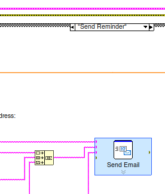

# Labview/Arduino soil moisture monitor and email reminder program:

Basically what it says on the tin. Written in LabView using the LINX addon to interface with the Arduino.

## Installation and setup

First install [LabView](https://www.ni.com/en/support/downloads/software-products/download.labview.html#487445) according to the instructions, then install the [LINX](https://www.ni.com/en/support/downloads/software-products/download.labview.html#487445](https://www.ni.com/gate/gb/GB_EVALTLKTLINXLVH/US)) addon according to its instructions (sadly only available for windows as of writing). 

In order to use the email feature, first enter the "Send Email" block in the "Send Reminder" state (shown below). I had used Gmail to send the emails, and have left some relevant fields populated to ease using that provider as well. You will need to make your own account and provide those credentials.

For the hardware I had used an Arduino Uno R3 and simple capacitative moisture sensors. Connect the sensors as per the providers instructions -- for me it was simply connecting the VCC, GND, and analog output pins between the sensor and the board. I had Chosen A0 as my analog pin, but you can change this on the dashboard if you choose another using the A(n) channel setting:

Also make sure that the COM port is set correctly!

## Usage

This repo includes two labview files -- one for using the sketch with hardware, and one using the sketch with user set soil moisture levels. I made the latter for troubleshooting the underlying state machines without also having to simultaniously troubleshoot the hardware, and is the easiest way to test out the functionality of the code.

## Contributing

Pull requests are welcome. For major changes, please open an issue first
to discuss what you would like to change.

Please make sure to update tests as appropriate.

## License

[MIT](https://choosealicense.com/licenses/mit/)
